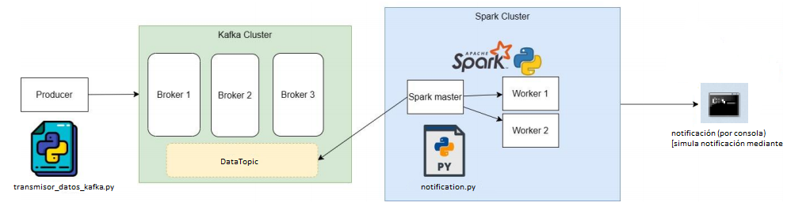
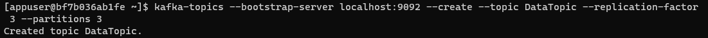
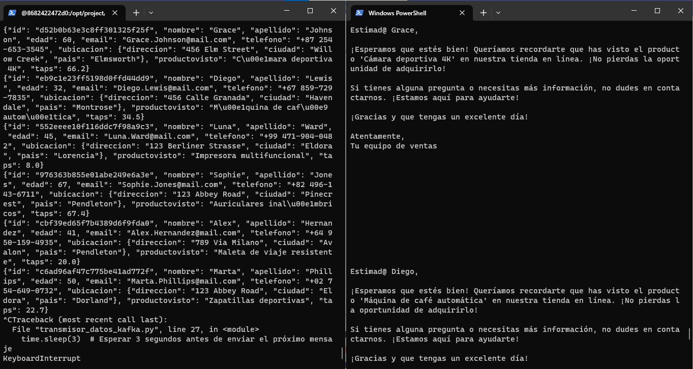

# Proyecto Kafka - Spark con Python

El proyecto consiste en realizar análisis en tiempo real de la información de navegación de los usuarios de una aplicación o página web de compras. Para lo cual se emula mediante Python, el envío de la información del usuario y el producto visto a un cluster de kafka, compuesto por 3 máquinas. Para simular el envío de los datos, se realizó un script en Python 'transmisor_datos_kafka.py' el cual genera datos aleatorios.

Posteriormente se recibe la información, haciendo uso del toíco (DataTopic) y se procesa con Spark y la API de SQL, en la cual se analiza la información recibida y se envía una notificación al usuario que vio un producto al menos por 30 segundos (tiempo de analisis en sgundos [TAPS] >= 30 segundos). Tan pronto como se detecte un registro con un taps >= 30 segundos, se emula el envío de una notificación, en este caso, mediante un mensaje en consola, pero perfectamente puede enviarse mediante API.

## Arquitectura del proyecto



## Pasos para ejecutar el Proyecto

### 1) Levantar los Contenedores

Se abre una terminal een la carpeta del proyecto y se ejecuta el siguiente comando:

```bash
docker-compose.yml
```

Para concer los nombres de los contenedores levantados, ejecutamos:

```bash
docker ps
```

### 2)Crear un tópico

```bash
docker exec -it kafka1-p bash
```

```bash
kafka-topics --bootstrap-server localhost:9092 --create --topic DataTopic --replication-factor 3 --partitions 3
```



### 3) Instalando las librerías en Kafka1-p

Dado que vamos a usar la maquina 'kfaka1-p' para generar la data y enviarla mediante Kafka, se hace necesario instalar la librería de Python, para enviar datos a Kafka.

```bash
pip install kafka-python
```

### 4) Generamos y trasnmitimos los Datos

 Posteriormente nos dirigimos a la ruta en linux **opt/project/code**

```bash
python transmisor_datos_kafka.py
```

### 5) Análisis en Tiempo Real con Spark y Envío de Notificación
Para ejecutar el script 'notification.py', se ingresa al Spark Master

```bash
docker exec -it proyecto-spark-kafka-spark-1 bash
```

Para ejecutar el script:

```bash
spark-submit --packages org.apache.spark:spark-sql-kafka-0-10_2.12:3.1.2 /opt/spark/code/notification.py
```
## Resultado

Se generan datos ficticios, se nevían al tópico DataTopic, análsis con Spark y notificación al cliente



### Vídeo

[Vídeo](https://youtu.be/WVdUlKyBsF4)